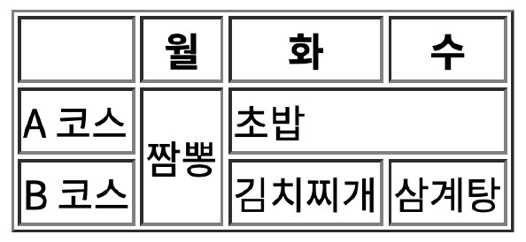

# 웹

## 웹 이란?

인터넷에 연결된 컴퓨터들을 통해 사람들이 정보를 공유할 수 있는 전 세계적인 정보 공간을 말한다.


### 서비스, 클라이언트, 서버

클라이언트가 요청(request)을 하면 서버가 응답(response)을 해주는 것을 서비스라고 함.


### GET, POST

GET은 요청을 직접적으로 url로 쏴주는 것이고 POST는 원하는 정보를 담아서 보내준다.(url에 정보가 노출 안됨)

POST의 경우 csrf_token이 필요하다.


## 동, 정적 웹

- 동적 웹: 실시간으로 변경사항이 반영된  웹페이지가 나온다.
- 정적 웹: 실시간으로 변하지 않는 웹페이지가 나온다.

무조건 동적웹이 좋은것도 나쁜것도 아니고 상황에 따라 알맞게 선택해야 한다.

### URI (Uniform Resource Identifier)

URL(Uniform Resource Locator)은 자원(파일)의 위치를 가리킴

일반적으로 URL을 사이트 주소로 알고 있지만, 컴퓨터 네트워크상 자원이 어디 있는지를 알려주기 위한 고유 규약으로 좀 더 넓은 의미를 가진다.

URI는 자원 식별자로 실제 위치가 아니어도 상관이 없게 됨.


## HTML(hyper text markup language)

- hyper text: 텍스트를 넘나드는 텍스트
- markup: 역할 부여
- language: 언어

=> 웹페이지를 작성하기 위한 표시 언어


### HTML 표준

W3C(World Wide Web Consortium), WHATWG(Web Hypertext Application Technology Working Group)

두 군데가 있는데 보통 WHATWG가 우세함.


### HTML의 구성

HTML은 보통 head와 body로 나눈다.

head의 경우 그 페이지에 대한 정보들을 담고 있다. (meta, link, style 태그 등 사용)

body의 경우 브라우저 화면에 나타낼 정보들을 담고 있다.


### HTML의 주석

<!-- 주석 내용 -->

주석 내용은 브라우저 화면에 나오지 않는다.


### HTML의 요소

요소는 태그들을 의미한다.


여는 태그가 있으면 닫는 태그가 있다.


대소문자 구분하진 않지만 소문자로 작성한다.


Self-closing 요소가 있는데 이러한 요소들은 닫는 태그가 필요하지 않다.

(img, meta, br, hr, input, link 등)


각 태그 안에는 속성을 넣을 수 있다.

속성명="속성값"으로 입력하며 띄워쓰기는 사용하지 않고 쌍따옴표 안에 넣어준다.


전역 속성으로 id, class, style 등이 있는데 이러한 속성은 태그에 관계없이 모두 사용 가능하다.


시멘틱 태그: 개발자 및 사용자 뿐만 아니라 검색엔진(구글, 네이버) 등에 의미 있는 정보의 그룹을 태그로 표현하여 단순히 보여주기 위한 것을 넘어서 의미를 가지는 태그들을 활용하기 위한 노력


HTML5에서 새롭게 추가된 시맨틱 태그


### 문자 태그

논 시멘틱 요소 div(블럭), span(인라인) 등

b태그 strong태그 둘 다 볼드체로 만들어주지만 strong의 경우 강조의 의미를 담고 있다.

i태그 em태그 둘 다 이태릭체로 만들어주지만 em의 경우 인용문구 등의 중요한 의미를 담고 있다.

mark태그 글자에 하이라이트를 해준다.(배경색)

del 태그 취소선 그어준다. 텍스트를 삭제 했음을 알려준다.

ins 태그 밑줄 그어준다. 텍스트가 새롭게 추가되었음을 나타낸다.

p태그. 단락을 의미함 줄바꿈이 일어나지 않음. 줄 바꾸고 싶을 경우 br태그를 통해 줄바꿈을 해줘야 한다.

pre태그는 안에 있는 요소들의 보이는 모양 그대로를 html에 보여준다.

q태그는 쌍따옴표로 보여주며 인용부분임을 나타냄

blockquote의 경우 인용부분 블럭을 만들어준다.

hr태그. 수평선 그어준다.


### 목록 태그

ol(순서 있는), ul(순서 없는)태그의 경우 자식 태그로 li들을 갖는다.

ol태그는 type속성으로 "1"숫자, "A"대문자 알파벳, "a"소문자 알파벳, "I"대문자 로마숫자, "i"소문자 로마숫자 등으로 보이게 할 수 있다. <ol type="1">

start 속성으로 시작값을 설정할 수 있다.<ol start="1">

reversed 속성을 사용하면 역순으로 보인다. <ol reverse>


li의 경우 style 속성을 통하여 보이는 방법을 다르게 표현할 수도 있다.

none, square, circle, lower-alpha, upper-alpha, upper-roman 등

예)

```
<li style="list-style-type: circle"> 내용 </li>
```

li태그에 value속성으로 직접 값을 줄 수 있으며 그 밑에 내용은 값 직접 준거 이후의 값으로 보인다.


### 링크 태그

a태그. 속성값으로 href를 가지며 target속성을 통해 현재창, 새 탭에서 링크 넘어가게 할 수있다.

```
target은 "_self"가 기본값이고 현재 창에서 열린다. "_blank"를 입력하면 새 탭에서 열린다.
```


### 미디어 태그

img태그. 속성값으로 src를 가진다. alt속성을 통해 이미지가 로드되지 않을 때 보여지는 문구를 넣을 수 있다.

video태그. 속성값으로 src를 가지며 autoplay 속성을 통해 자동재생 여부를 정할 수 있다.

iframe 태그. 속성값으로 src를 가지며다른 html문서를 브라우저 내에 띄워준다.


### 테이블 태그

```
<table border="ipx solid black">
    <tr>
    	<th> 테이블 제목 </th>
        <td>
    </tr>
</table>
```

tr 태그는 테이블에서 하나의 줄을 의미하고 th는 열의 제목, td는 세부 내용에 해당한다.

th와 td에는 rowspan, colspan 속성을 줄 수 있으며 각 각 행과 열을 늘려주는 역할을 한다.



빈칸, 월, 화, 수 => 각각 th태그

나머지 모두 td

짬뽕 rowspan=2, 초밥 colspan=2


## 폼

#### form

여러가지 입력할 수 있는 요소들을 포함한다. 이러한 입력을 지정한 url로 보내준다.

action은 필수 옵션이고, method는 명시하지 않으면 GET. method는 GET 방식과 POST 방식이 있다.

POST방식의 경우 폼 안에 {{ csrf_token }}을 넣어주어야 한다.


#### input

disabled를 통해 비활성화 시킬 수 있다.

- text: 텍스트가 입력 가능하다. placeholder="하고싶은 말"을 통해 미리 보여지는 글을 쓸 수 있다.

- number: 숫자만 입력 가능하다. 오른쪽에 숫자를 높이거나 낮추는 버튼이 있다. step, min, max 옵션을 지정 가능.

- password: 비밀번호 입력하는 텍스트박스다. 입력해도 *로 보인다.

- email: 이메일 형식이 입력되어야 한다. 그렇지 않으면 에러가 뜨고 전송되지 않는다.

- date: 연-월-일 표시되며 달력도 볼 수 있다.

- radio: 라디오 버튼. 항목들 중 하나를 고를 수 있다. 각 버튼마다 name을 지정해 주어야 한다. 같은 name를 가진것끼리는 하나밖에 선택할 수 없다.

- select: 리스트박스. 항목들 중 하나를 고를 수 있다. size설정을 통해 여러개 보이게 할 수도 있다.(size="3") 각 항목은 option태그이며 닫힘태그 사이에 보여질 말을 작성하면 된다. 보낼 때의 값은 value로 지정해 준다.

  내부의 항목들을 optgroup태그로 그룹화 할 수 있으며 그 그룹명을 label속성으로 입력해야한다.

  ```
      <select name="" id="" size="6">
          <optgroup label="a">
              <option value="">1</option>
              <option value="">2</option>
          </optgroup>
          <optgroup label="b">
              <option value="">1</option>
              <option value="">2</option>
          </optgroup>
      </select>
  ```

  

- checkbox: checked 옵션을 통해 미리 체크되게 표시할 수 있다.

- textarea: 여러 줄의 입력을 할 수 있게 만든다. rows(줄 수), cols(글자 수)를 지정할 수 있다.

여러가지 타입이 있다. text, number, password, email, date, radio, select, checkbox, submit 등

여러 요소들을 그룹화하는 fieldset태그도 있다. 내부에 legend태그를 통해 field셋의 이름을 보여준다.

- label: 속성으로 for를 가지며 input들의 아이디를 입력해줄 수 있다.


## Cascading Style Sheet

css에선 셀렉터를 통해 그 셀렉터에 해당하는 속성을 정의해 줄 수 있다.

html에서 css를 불러오기 위해 헤드태그 안에 link태그를 통해 가져올 수 있다.    <link rel="stylesheet" href="01_css_intro.css">

주석은 /* 이런식으로 작성한다. */

html 내부에 css포함하려면 헤드태그 안에 style태그로 작성한다

<style>
    h1{
        속성
    }
</style>

외부참조하려면 <link rel="stylesheet" href="파일명">


#### 선택자(selector)

*은 모든 태그를 선택하고 전체적으로 속성을 줄 수 있다.

각 태그를 쓰면 그 해당하는 모든 태그에 속성을 줄 수 있다.

아이디를 쓰면 해당 아이디 요소에 속성을 줄 수 있다. id를 쓸 때는 앞에 #을 붙여준다.

클래스를 쓰면 해당 클래스에 속성을 줄 수 잇다. 클래스를 쓸 때는 앞에 .을 붙여준다.

, 를 이용해 여러개의 선택자를 작성 할 수 있다.

, 없이 작성하면(ol li 혹은 ol > li 등) 후손, 자손 태그를 선택하는 방법이 된다.

ol > li:nth-child(4): ol의 4번째 자손이 li일 경우 속성을 지정해준다.

ul > li:nth-of-type(4): ul의 자손 li들 중 4번째 자손에게 속성을 지정한다.


#### 속성(프로퍼티)

em: 현재 사이즈의 배수를 의미하며 rem은 기본 사이즈(크롬 16px)의 배수를 말한다.

color: 색깔이름(skyblue, black, red 등)이나 rgb( 45, 223, 112), #000000 등으로 나타낼 수 있다.

font-size: 픽셀, rem, em등으로 표현가능

font-family: 폰트명, 폰트가 없으면 보일 폰트명

font-weight: 글자 두께 400이 보통. 700이 bold

letter-spacing: 자간. 음수 값 가능

word-spacing: 단어간 사이.

text-align: 텍스트 정렬. left, right, center을 통해 정렬할 수 있다.

margin: 마진 설정할 수 있다. 하나만 줄 경우 모든방향. 둘 줄 경우 위아래와 좌우. 셋 줄경우 위, 좌우, 아래. 넷 줄경우 시계방향(위 오른쪽 아래쪽 왼쪽.) auto일 경우 해당 방향 마진이 최대가 된다.

padding도 마진과 동일.

border: border-width로 테두리 굵기, border-style로 스타일(dotted, solid, dashed, none, hidden  등 지정 가능) 여러개 입력하면 마진 패딩처럼 상하좌우 설정해줄 수 있다. border-top-style등 각 각의 요소 지정도 가능함.


숏핸드(단축)

border-style

border-width

border-color

이런 것들을 한번에 할수 있게 만든다.

border: 50px; dashed; black;


배경이미지: background-image: url("images/e.jpg")


마진은 테두리 외부에 여백, 패딩은 테두리 내부의 여백이다.


#### 속성의 단위

1 rem = 16px(크롬 기준)

vw, vh의 경우 각각 브라우저 화면의 1/100을 의미한다

vmin, vmax의 경우 높이나 너비 중 가장 작은것, 가장 높은것 기준으로 1/100을 의미한다.

구버전에서 지원하지 않으며 ie 9~11, edge의 경우 지원이 완벽하지 않기에 주의가 필요하다.

색깔의 경우 HEX, RGB, RGBA 가 있다. RGBA는  RGB에 알파값이 추가된것으로 알파값 0이 투명함, 1이 불투명함. 그 사이값으로 투명도 조절 가능하다.


#### display 타입

display 보여지는 타입을 설정할 수 있다. inline, block, inline-block, none로 설정할 수 있으며 각 태그마다 기본 

설정된 값이 있다. none의 경우 공간조차 차지하지 않는다.

visibility: hidden;의 경우 공간은 차지하지만 보이지 않는다.

block의 경우 항상 새로운 줄에서 시작하며 너비는 항상 화면 전체를 차지한다.

높이, 너비 등을 설정 가능하며 마진 패딩을 줄 수 있다.block 레벨 요소 예

- div
- h1 ~ h6
- p
- ol
- ul
- li
- hr
- table
- form

inline의 경우 너비는 항상 콘텐트 너비랑 같다. 너비 높이 마진(상하)을 줄 수 없다. 내부에 block요소를 포함할 수 없다.

inline 레벨 요소 예

- span
- a
- strong
- img
- br
- input
- select
- textarea
- button

inline-block의 경우 인라인과 블럭 두가지 특성을 다 가져 한 라인 안에 계속 써질수 있으며 마진, 높이, 패딩 등을 설정할 수 있다.


#### position

static: 기본 위치.

relative: 보이는 위치만 옮긴다. 원래 위치에서 공간을 차지하고 있음.

absolute: 위치를 옮긴다. 부모가 static이 아닐 경우 부모기준, 부모가 static일 경우 브라우저 기준으로 동작함.

fixed: 브라우저 기준으로 동작한다. bottom: 0 을 하면 브라우저 맨 밑으로 내려감.

z-index: 곂쳐질경우 값이 높은것이 앞에 보이게 된다.


#### 우선순위

1. !important
2. inline styling
3. #id
4. .class
5. tag
6. 상속


## 부트스트랩

부트스트랩은 CDN(콘텐트 딜리버리 네트워크)을 통해 개별 유저에 가까운 서버를 활용해 데이터를 제공한다. 따라서 다운받지 않고도 사용할 수 있다.(CSS, JS, Image, Text 등)

부트스트랩 css링크는 헤드태그 안에, 나머지 소스들은 바디태그 안에 넣어준다.

부트스트랩은 h태그부터 mark 등 다양한 태그들이 다른 속성으로 지정되게 만든다.


### 속성(클래스)

#### 마진 등

m,p 등	rem

0			0

1			0.25

2			0.5

3			1

4			1.5

5			3

n1		-0.25

n2		-0.5

n3		-1

n4		-1.5

n5		-3


#### 배경색  지정

bg-primary 파란색

bg-secondary 회색

bg-success 초록색

bg-danger 빨간색

bg-warning 노란색

bg-info 비취색

bg-light 밝은색

bg-dark 검은색


#### 버튼, 경고창

```
<div class="btn btn-primary" >파란 버튼!</div>
```

    <div class="alert alert-info" >에메랄드색 경고창</div>


#### 보더

```
    <div class="border border-primary">경계를 파란색으로</div>
    <div class="border border-danger">경계를 빨간색으로</div>
    <div class="border border-success">경계를 초록색으로</div>
    <br>

    <span class="border">이건 4개가 border가 있고</span><br>
    <span class="border-top">이건 위만</span><br>
    <span class="border-right">이건 오른쪽만</span><br>
    <span class="border-left">이건 왼쪽만</span><br>
    <span class="border-bottom">이건 아래쪽만</span><br>
    라운디드도 있다. circle의 경우 둥글게, top의 경우 위쪽 모서리 두개 0의 경우 라운딩을 없애준다.
    rounded-circle, rounded-top, rounded-0 등
```


#### 디스플레이 타입

```
인라인으로
    <div class="d-inline p-2 bg-primary">d-inline</div>
    <div class="d-inline p-2 bg-dark">d-inline</div>
    <br>
    <br>
블록으로
    <span class="d-block p-2 bg-primary">d-block</span>
    <span class="d-block p-2 bg-danger">d-block</span>
none로도 가능함.
flex도 가능하다.
```


#### flex

플렉스의 경우 컨테이너 속성에 flex-wrap: wrap-reverse를 넣으면 역순으로 내부것들을 정렬할 수 있다.

flex-direction: column-reverse, column, row-reverse, row 가능함.

align-items:는 수직 정렬이며 center, flex-start, flex-end 등 가능함

justify-content: 수평 정렬이다. 레프트 라이트 센터 가능

개별속성 지정할 경우 style="align-self: flex-end" 등으로 지정 가능함.


#### float

둥둥 떠다니게 만든다. float:left 이런식으로 여러개를 동시에 선택해서 지정해주면 왼쪽에 정렬된다. 사이즈를 알 수 없게 만들기 때문에 담고있는 컨테이너의 사이즈가 이상해 질 수 있다.


#### 반응형

col-sm-12, col-md-6, d-lg-block, d-xl-none 등 여러가지 방식으로 가능함.

sm, md, lg, xl은 각각 576px, 768px, 992px, 1200px 이상일 때 동작한다.

콘테이너 사이즈는 540 720 960 1140이다.


#### 텍스트 속성

text-center

font-weight-bold


#### 미디어 쿼리

스타일 태그에 @media (max-width: 1024px) {

지정할 스타일

}

이런식으로 작성하면 최대 너비 1024를 넘지 않을때 해당 스타일을 지정할 수 있다.

min-width도 가능함.