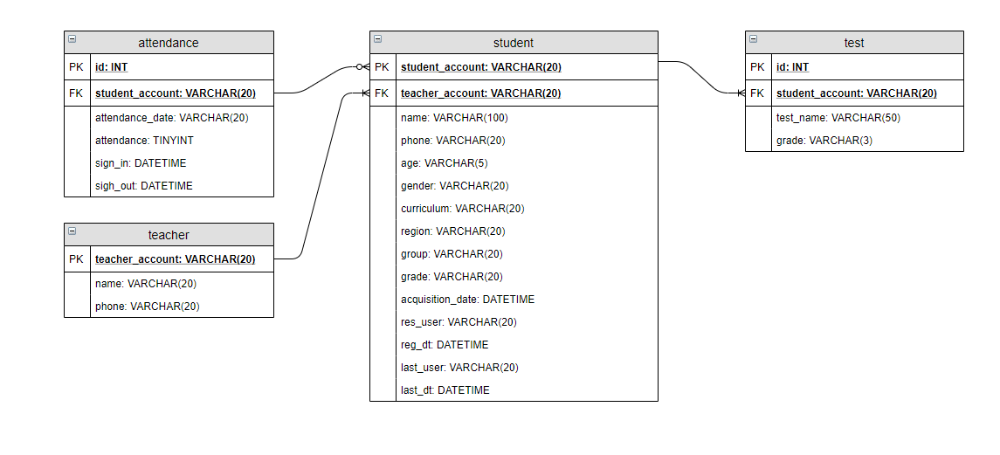
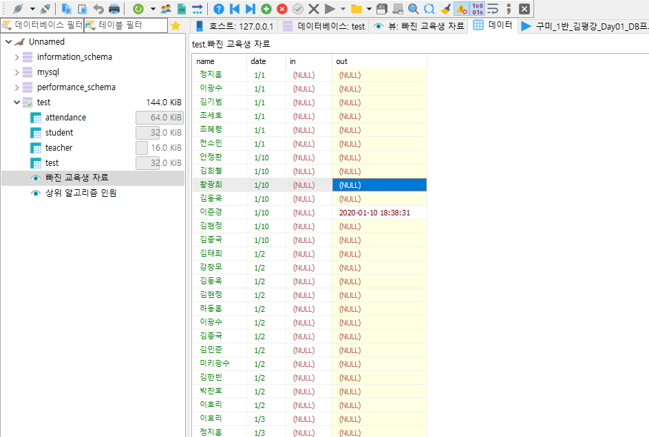

# DB 실습

## 준비물

USER_DATA.SQL, USER_TABLE.SQL

USER_TABLE.SQL파일을 열어서 쿼리로 실행하면 TABLE이 생성되며, USER_DATA.SQL 파일을 열어서 쿼리로 실행하면 데이터가 입력된다.

이 데이터를 받아서 적절하게 변환하여 우리가 쉽게 볼 수 있는 뷰를 만들어 주는 실습을 진행할 것이다.


## ERD




## 구조를 이렇게 만든 이유

출석 일자는 여러개의 칼럼을 사용하는 것이 아닌, 하나의 테이블을 추가하여 student 테이블을 사용할 때 필요 없는 날짜(모든 날짜들을 매번 관심을 가지지 않습니다)들에 대한 데이터를 가져오지 않게 하였습니다.

출석(attendance) 테이블은 student_account을 외래키로 삼고 있으며, 원하는 날짜를 입력하여 조회 가능합니다.


시험 성적(test) 테이블도 마찬가지로 매번 모든 성적에 대하여 관심을 갖지 않으므로 테이블을 분리하여 필요 시에만 가져오도록 하였습니다.

student_account을 외래키로 삼고 있으며, 학생 계정과 조회하고자 하는 시험 이름을 사용하여 관심 있는 시험의 성적 조회가 가능합니다.


선생님에 대한 데이터가 여러번 중복되어 이를 피하기 위하여 teacher 테이블을 만들었으며, student 테이블에서 teacher_account를 외래키로 가지고 있습니다. 이를 통해 중복된 데이터의 사용을 줄일 수 있습니다.


## 뷰

각 날짜별 출석하지 않은 학생들을 보여주는 뷰

```mariadb
select `student`.`name` AS `name`,`attendance`.`attendance_date` AS `date`,`attendance`.`sign_in` AS `in`,`attendance`.`sign_out` AS `out` from (`student` join `attendance` on(`student`.`student_account` = `attendance`.`student_account`)) where `attendance`.`attendance` is null order by `attendance`.`attendance_date`
```

결과




커리큘럼, 지역, 팀별 A+인원을 조회하는 뷰

```mariadb
select count(case when `student`.`curriculum` = '1' then 1 end) AS `1기 A+ 인원`,count(case when `student`.`curriculum` = '2' then 1 end) AS `2기 A+ 인원`,count(case when `student`.`region` = '서울' then 1 end) AS `서울 A+ 인원`,count(case when `student`.`region` = '대전' then 1 end) AS `대전 A+ 인원`,count(case when `student`.`region` = '광주' then 1 end) AS `광주 A+ 인원`,count(case when `student`.`region` = '구미' then 1 end) AS `구미 A+ 인원`,count(case when `student`.`region` = '서울' then 1 end and case when `student`.`group` = '1' then 1 end) AS `서울 1팀 A+ 인원`,count(case when `student`.`region` = '서울' then 1 end and case when `student`.`group` = '2' then 1 end) AS `서울 2팀 A+ 인원`,count(case when `student`.`region` = '서울' then 1 end and case when `student`.`group` = '3' then 1 end) AS `서울 3팀 A+ 인원`,count(case when `student`.`region` = '대전' then 1 end and case when `student`.`group` = '1' then 1 end) AS `대전 1팀 A+ 인원`,count(case when `student`.`region` = '대전' then 1 end and case when `student`.`group` = '2' then 1 end) AS `대전 2팀 A+ 인원`,count(case when `student`.`region` = '광주' then 1 end and case when `student`.`group` = '1' then 1 end) AS `광주 1팀 A+ 인원`,count(case when `student`.`region` = '광주' then 1 end and case when `student`.`group` = '2' then 1 end) AS `광주 2팀 A+ 인원`,count(case when `student`.`region` = '구미' then 1 end and case when `student`.`group` = '1' then 1 end) AS `구미 1팀 A+ 인원` from `student` where `student`.`grade` = 'A+'
```

결과

