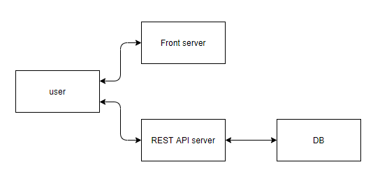
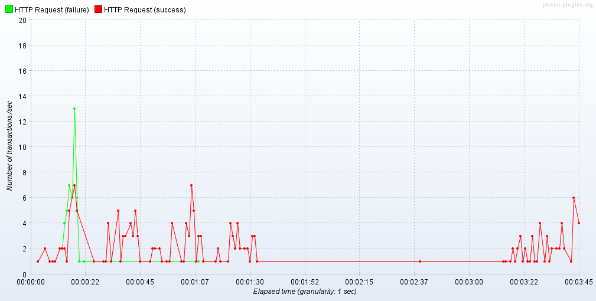
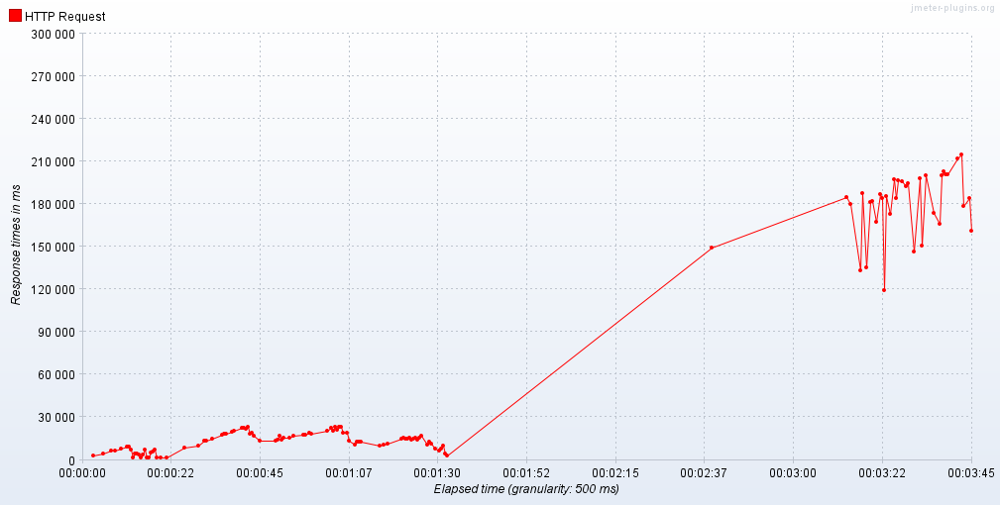
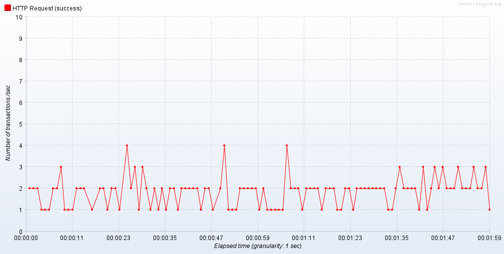
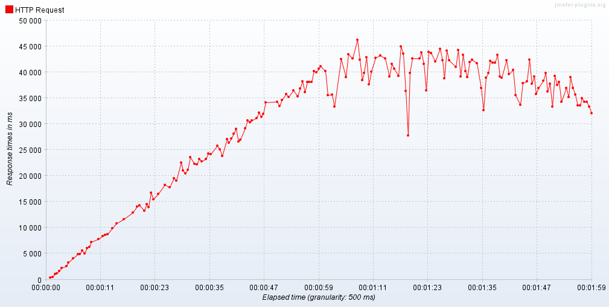

# REDIS

## REDIS란?

SQL과 다르게 원하는 데이터를 해싱하여 O(1)에 제공할 수 있도록 만들어 주는 서버이다.

가장 큰 장점은 속도이다. 자주 사용하지만 변하지 않는 데이터의 경우 매 요청마다 쿼리를 날려 db를 탐색할 필요가 없이 미리 저장되있는 데이터를 보내 주면 시스템 부담도 줄어들고 반응 속도 또한 빨라진다.

인 메모리 방식은 서버가 다운되면 정보가 모두 날아갈 수 있다는 것이 문제 중 하나인데, REDIS는 이러한 문제를 예방하기 위하여 다른 서버에 데이터를 분산시켜 주거나 디스크에 직접 저장하는 방법 등을 지원하여 이러한 문제를 예방한다.


단점은 데이터를 여러곳에 분산 저장하기때문에 많은 메모리를 사용하게 된다는 것이다.


## REDIS 도입 타당성 검토

REDIS는 속도가 빠른 대신 메모리를 사용하기 때문에 데이터 저장에 한계가 있다. 따라서 모든 데이터를 REDIS에서 사용하는 것이 아니라 선별적인 데이터를 REDIS에서 캐싱하여 사용하는 것이 필요하다.

따라서 프로젝트에서 데이터 캐싱이 가장 필요한 곳을 분석하고 그 곳에 적용하는 것이 필요하다.

### 프로젝트 시스템 아키텍처



프로젝트의 시스템 아키텍처는 다음과 같다.

사용자의 요청이 많아질 경우 가장 많은 부하가 걸리는 곳은 DB이다. 그 이유는 DB에서만 요청에 의한 쿼리를 수행하여 데이터를 색인하기 때문인데, 이 데이터가 많을수록 시간이 많이 걸리게 된다.

따라서 DB에서 쿼리를 수행하는 횟수를 줄여야 하는데 이를 REDIS를 적용하여 자주 사용되는 쿼리를 캐싱한다면 효과적으로 줄일 수 있을 것으로 예상된다.


## 준비사항

restapi, db 서버 구축, redis 설치


## restapi 서버 구동하기

서버는 정상적으로 구동 가능하다는 전제

maven, java등 기본적인 설정은 사용자마다 다르므로 maven wrapper 사용 기준으로 설명한다.

restapi 루트 폴더에서 아래의 명령어를 입력한다.

mvnw package

입력 시 스냅샷파일(.jar)이 타겟 폴더에 생성된다.

java jar target 생성된스냅샷파일명.jar


## db 서버 구동하기

mariadb가 설치되어 있어야 하며 덤프 파일도 있어야 한다.


-p 옵션은 비밀번호 -uroot 옵션은 DB루트계정

anearly는 db이름(이미 생성되 있는 db)

<anearly.sql 은 기존의 db에 anearly.sql파일을 덮어씌운다는 의미이다.

이때 sql파일은 파워셀 명령을 입력하는 경로에 위치하여야 한다.(user 폴더)

```powershell
mysql -uroot -p anearly<anearly.sql
```

만약 anearly db가 없을 경우 생성해야한다.

mysql -u root -p

비밀번호 입력 후

create database anearly;


만약 루트계정 비밀번호 설정이 안 된 경우

mysql -u root 로 가능하다.

비밀번호 설정은 루트계정 접속 후

set password for 'root'@'localhost'=password('원하는비밀번호');

로 변경할 수 있다.


두 서버를 구동하였으면 정상 동작하는지 스웨거에 들어가서 확인해 본다.

http://localhost:8989/swagger-ui.html#/


## Django 프로젝트에 redis 적용하기

redis 적용하기 위해선 redis가 설치되어 있고 실행중이어야 한다.

또한 django-redis가 설치되어야 한다.


docker에서 redis 서버를 구축한다.

```bash
docker pull redis
docker run --name some-redis -d -p 6379:6379 redis
```

redis를 원격으로 받아와서 이미지를 만든다

--name some-redis는 some-redis라는 이름의  컨테이너

-d옵션은 백그라운드에서 실행

-p 6379:6379는 특정한 포트 개방

맨 마지막의 redis는 redis 이미지를 가져오겠다는 의미이다.


다음의 명령어를 입력하여 django-redis를 설치한다.

pip install django-redis

settings.py 파일에다가 caches를 사용한다고 알려줘야 한다.

```python
CACHES = {
    'default': {
        'BACKEND': 'django_redis.cache.RedisCache',
        'LOCATION': 'redis://127.0.0.1:6379',
    },
}
```


redis 사용하지 않는 원래 코드

```python
@api_view(['GET'])
def music_list(request):
    musics = Music.objects.all()
    serializer=MusicSerializer(musics, many=True)
    return Response(serializer.data)
```


view 파일에서 캐시를 사용하려면 다음과 같이 시도한다.

```python
from django.core.cache import cache

@api_view(['GET'])
def music_list(request):
    musics = cache.get('musics', None)
    if not musics:
        musics = Music.objects.all()
        cache.set('musics', musics, 10)
    serializer=MusicSerializer(musics, many=True)
    return Response(serializer.data)
```


cache.get('musics', None)은 레디스에서 'musics'라는 키 값을 조회해서 데이터가 있을 경우 그 값을, 없을 경우 None을 반환해 준다.

cache.set('musics', musics, 10)에서 'musics'는 redis의 키 이름, musics는 내가 가져온 데이터, 10은 레디스에서 데이터를 가지고 있을 시간(초) 이다.


## 결과

측정은 jmeter을 이용하여 한다.

사용한 api는 db에 존재하는 모든 음악 정보를 가져오는 서비스이다.


설정은 startup time 20초, hold load 60초 shutdown 10초로 총 90초동안 70명의 유저를 가정하여 측정해 보았다.


### REDIS를 적용한 경우

tps



response time




### REDIS를 적용하지 않은 경우

tps



response time




## 후기

REDIS를 적용했을 때보다 적용하지 않았을 때의 결과가 더욱 안정적이었다. 그 이유는 쿼리가 단순해서 db에 부하가 크게 걸리지 않기 때문이라 생각한다. 복잡한 쿼리 요청 중 자주 사용되는 요청이 있다면 이 결과가 반전될 것으로 예상된다.

단순한 쿼리에 적용하였기 때문에 속도 향상을 체감할 수 없었다. 하지만 REDIS에 대해서 공부하면서 이러한 관리가 중요하다는 것을 깨닫게 되었으며, 앞으로 REDIS를 적용하여 적절한 효율을 낼 수 있는 방법을 고안하여 더욱 안정적이면서 빠른 서비스를 제공할 수 있도록 노력할 것이다.