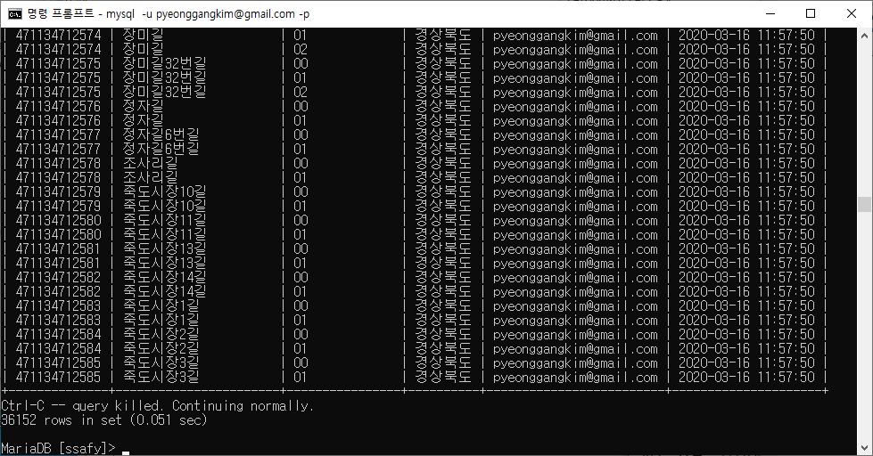
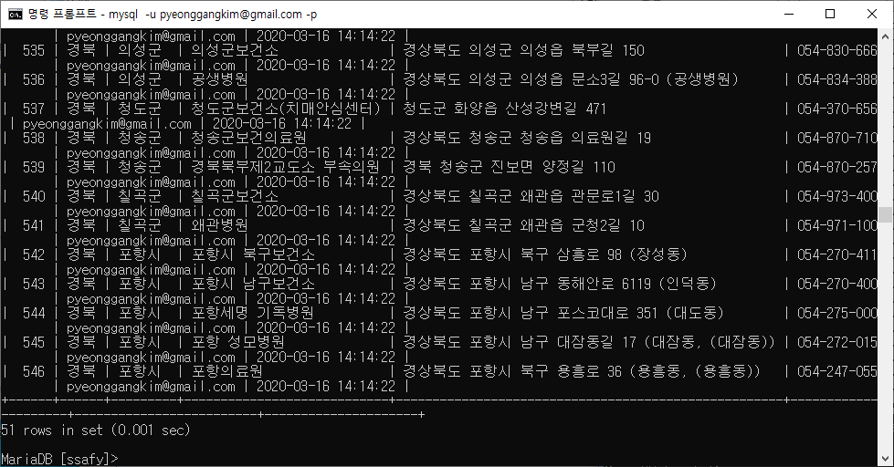

# DB 데이터 적재 및 가공

## 요구사항

유저를 생성

db를 생성

데이터를 db에 저장

db에 저장하기 위하여 적절한 형태의 테이블 생성

필요한 데이터 선별 및 컬럼 추가 후 데이터 기록

db의 데이터를 csv 파일로 export


## 유저를 생성하는 방법

루트 계정에 들어간다.

```bash
mysql -u root -p
```

루트 계정에서 새로운 계정을 생성한다.

```bash
mysql -u pyeonggangkim@gmail.com -p
```

생성한 계정에 권한을 추가해 준다.

```bash
grant file on *.* to 'pyeonggangkim@gmail.com'@'localhost'
```


## 스키마 생성

테이블 만들기 전에 myschema 스키마를 만든다.

```bash
create schema myschema
```


## 테이블 생성

테이블 만들려면 사용할 스키마를 선택해야 한다.

```bash
use myschema
```

스키마를 선택했으면 테이블을 생성한다.

```mysql
create table temp (
도로명코드 varchar(12),
도로명 varchar(80),
도로명_en varchar(80),
읍면동일련번호 varchar(2),
시도명 varchar(20),
시도명_en varchar(40),
시군구명 varchar(40),
시군구명_en varchar(80),
읍면동명 varchar(20),
읍면동명_en varchar(40),
읍면동구분 varchar(1),
읍면동코드 varchar(3),
사용여부 varchar(1),
변경사유 varchar(1),
변경이력정보 varchar(14),
고시일자 varchar(8),
말소일자 varchar(8)
);

create table temp2 (
연번 varchar(5),
검사채취 varchar(2),
시도 varchar(10),
시군구 varchar(10),
의료기관명 varchar(100),
주소 varchar(100),
대표전화번호 varchar(150)
) default charset=euckr;
```

원본 파일의 데이터를 모두 받아오기 위하여 다음과 같이 구성하였다.


## DB에 데이터 저장하기

인코딩 문제를 방지하기 위하여 원본 파일을 편집으로 열어서 utf8로 저장해 준다.

데이터를 불러온다.

도로명코드 txt 파일의 경우 |로 칼럼이 구분되어 있으므로 

```mysql
load data infile '개선_도로명코드_전체분.txt' into table temp character set utf8 fields terminated by '|';
```

명령으로 데이터를 읽어온다.


선별진료소 csv 파일의 경우 , 로 구분되어 있다. 하지만 컬럼 중 , 가 있는 것을 확인하였다.

csv파일 중 컬럼 내용안에 콤마가 들어가 있으면 문제가 발생하므로 미리 전처리를 해 준다.

csv 파일을 엑셀로 열어서 탭 구분 데이터로 내보내기를 통해 내보낸다.

해당 파일을 편집하기로 열어서 쌍따옴표를 지워준다.(메모장의 편집 - 바꾸기 - "을 빈칸으로 모두 바꾸기)

```mysql
load data infile '선별진료소.txt' into table temp2 character set utf8 columns terminated by '\t' optionally enclosed by '"' lines terminated by '\n' ignore 1 lines;
```


## 필요한 데이터만 선별해서 테이블에 저장

위의 temp 테이블에서 필요한 데이터만 선별해서 가져오기 위하여 다음과 같이 사용할 테이블을 정의한다.

```mysql
create table addr (
도로명코드 varchar(12),
도로명 varchar(80),
읍면동일련번호 varchar(2),
시도명 varchar(20),
입력자 varchar(50),
입력일자 timestamp default current_timestamp on update current_timestamp
);
```

테이블 생성 후 쿼리문을 통해서 addr 테이블에 데이터를 넣어 준다.

```mysql
insert into addr (도로명코드, 도로명, 읍면동일련번호, 시도명)
select 도로명코드, 도로명, 읍면동일련번호, 시도명 from temp where 시도명='경상북도';
```

입력자를 넣어주기 위하여 쿼리문을 사용한다.

```mysql
update addr set 입력자 = 'pyeonggangkim@gmail.com';
```


위의 temp2 테이블에서 필요한 데이터만 선별해서 가져오기 위하여 다음과 같이 사용할 테이블을 정의한다.

```mysql
create table medical (
연번 integer,
시도 varchar(10),
시군구 varchar(10),
의료기관명 varchar(100),
주소 varchar(100),
대표전화번호 varchar(50),
입력자 varchar(50),
입력일자 timestamp default current_timestamp on update current_timestamp
) default charset=euckr;
```

테이블 생성 후 쿼리문을 통해서 medical 테이블에 데이터를 넣어 준다.

```mysql
insert into medical (연번, 시도, 시군구, 의료기관명, 주소, 대표전화번호)
select 연번, 시도, 시군구, 의료기관명, 주소, 대표전화번호 from temp2 where 시도='경북';
update medical set 입력자 = 'pyeonggangkim@gmail.com';
```

입력자를 넣어주기 위하여 쿼리문을 사용한다.

```mysql
update addr set 입력자 = 'pyeonggangkim@gmail.com';
```


## DB 데이터 export

DB의 데이터를 백업, 공유 등으로 내보내야 할 경우가 생긴다. 이런 경우 csv파일을 생성하면 좋다.


addr 테이블을 추출하기 위하여 아래의 명령을 입력한다.

```mysql
SELECT
*
FROM
addr
INTO OUTFILE
'addr_pyeonggangkim.csv'
FIELDS ENCLOSED BY '"'
TERMINATED BY ','
ESCAPED BY '"'
LINES TERMINATED BY '\n';
```


medical 테이블을 추출하기 위하여 아래의 명령을 입력한다.

```mysql
SELECT
*
FROM
medical
INTO OUTFILE
'medical_pyeonggangkim.csv'
FIELDS ENCLOSED BY '"'
TERMINATED BY ','
LINES TERMINATED BY '\n';
```


추출이 완료되었다.


## 결과



