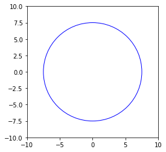
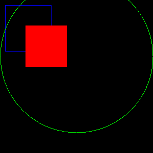
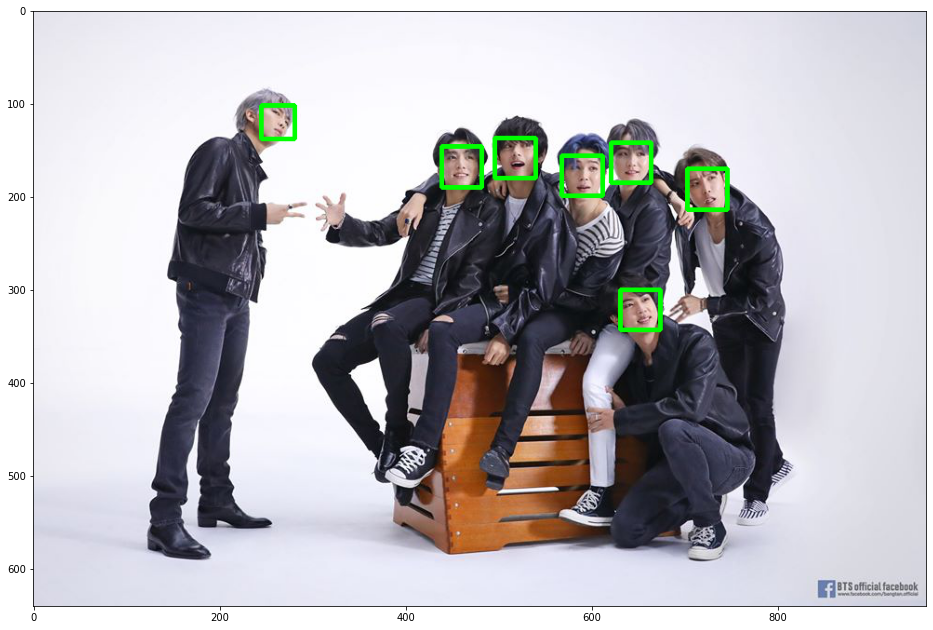
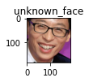
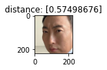
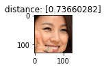
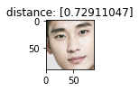
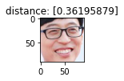

# Colab 기반 얼굴인식 입문

## Colab이란?

Colab은 Jupyter Notebook와 비슷하게 웹 브라우저 상에서 소스코드를 작성하고 실행 및 디버깅을 해 볼 수 있는 어플리케이션이다.

주요 특징은 구글 클라우드 컴퓨팅 환경의 GPU와 TPU에 무료로 접근하여 사용할 수 있으며, 소스코드와 데이터를 Google Drive와 연동하여 사용하고 저장할 수 있는 개발 환경이다.

Cloud 기반이므로 별도의 설치 과정 없이 딥러닝, 머신러닝 등 다양한 분야에 사용 가능하다.


## Colab에 Google Drive의 ipynb 파일 연결하기

Colab에 Google Drive의 ipynb 파일을 연결하기 위해선 우선 ipynb 파일을 구글 드라이브에 업로드 해 줘야 한다.

구글 드라이브에 업로드가 완료 된 후 연결 앱에서 더 많은 앱 연결하기 -> Colab 검색 후 추가를 해 준다.

이후 드라이브에서 ipynb 파일을 Colab으로 실행시켜 주면 노트북 파일이 드라이브 상에서 열리게 된다.

기본적인 사용법은 Jupyter Notebook와 동일하다.

터미널 명령을 사용하고 싶은 경우 맨 앞에 !로 알려주면 된다.

pip install cv2

를 하고 싶은 경우

!pip install cv2

이렇게 코드 실행창에 입력 후 실행하면 된다.


## 코드 스니펫

Colab에는 몇몇 코드들이 미리 정의되어 있으며 삽입 - 코드 스니펫에서 원하는 코드 선택 후 삽입하기를 하면 미리 정의된 코드를 손쉽게 가져다 쓸 수 있다.

카메라캡쳐,  데이터 플롯 등 다양한 기능이 있으며 손쉽게 사용 가능하다.


## 구글 드라이브 연동하기

Colab에서 구글 드라이브를 연동하려면 스니펫 중 Saving data to Google Drive를 가져와서 실행하면 된다.

인증절차를 하고 나면 Sample file.txt 파일이 내 구글 드라이브에 저장이 된다.


## CPU 및 GPU 가속의 속도 차이 체험

https://colab.research.google.com/notebooks/gpu.ipynb

이 곳에 가면 예제 코드가 있다.

우선 GPU를 사용하기 위해선 Colab에서 GPU 환경을 설정해 줄 필요가 잇다.

런타임 - 런타임 유형 변경 - 하드웨어 가속기에서 GPU를 선택해 준다.

이후 위의 링크에 있는 코드를 실행하면 

```python
%tensorflow_version 2.x
import tensorflow as tf
device_name = tf.test.gpu_device_name()
if device_name != '/device:GPU:0':
  raise SystemError('GPU device not found')
print('Found GPU at: {}'.format(device_name))
```

TensorFlow 2.x selected.

Found GPU at: /device:GPU:0

GPU가 있는지 확인하고 GPU가 있으면 GPU 정보를 반환하는 코드이다.


GPU정보를 입력하여 CPU연산과 비교하는 코드

```python
%tensorflow_version 2.x
import tensorflow as tf
import timeit

device_name = tf.test.gpu_device_name()
if device_name != '/device:GPU:0':
  print(
      '\n\nThis error most likely means that this notebook is not '
      'configured to use a GPU.  Change this in Notebook Settings via the '
      'command palette (cmd/ctrl-shift-P) or the Edit menu.\n\n')
  raise SystemError('GPU device not found')

def cpu():
  with tf.device('/cpu:0'):
    random_image_cpu = tf.random.normal((100, 100, 100, 3))
    net_cpu = tf.keras.layers.Conv2D(32, 7)(random_image_cpu)
    return tf.math.reduce_sum(net_cpu)

def gpu():
  with tf.device('/device:GPU:0'):
    random_image_gpu = tf.random.normal((100, 100, 100, 3))
    net_gpu = tf.keras.layers.Conv2D(32, 7)(random_image_gpu)
    return tf.math.reduce_sum(net_gpu)
  
# We run each op once to warm up; see: https://stackoverflow.com/a/45067900
cpu()
gpu()

# Run the op several times.
print('Time (s) to convolve 32x7x7x3 filter over random 100x100x100x3 images '
      '(batch x height x width x channel). Sum of ten runs.')
print('CPU (s):')
cpu_time = timeit.timeit('cpu()', number=10, setup="from __main__ import cpu")
print(cpu_time)
print('GPU (s):')
gpu_time = timeit.timeit('gpu()', number=10, setup="from __main__ import gpu")
print(gpu_time)
print('GPU speedup over CPU: {}x'.format(int(cpu_time/gpu_time)))
```

Time (s) to convolve 32x7x7x3 filter over random 100x100x100x3 images (batch x height x width x channel). Sum of ten runs.

CPU (s):

3.3230506459999987

GPU (s):

0.09633825299999899

GPU speedup over CPU: 34x


GPU를 사용 시 CPU보다 약 34배 정도의 속도 차이를 보이는 결과를 확인하였다.


## matplolib에서 도형 그리기

```python
import matplotlib as mp

circle_center = (0, 0)
circle_radius = 7.5
c = mp.pyplot.Circle(circle_center, circle_radius, fc='w', ec='b')
a = mp.pyplot.axes(xlim=(-10, 10), ylim=(-10, 10))
a.add_patch(c)
a.set_aspect('equal')
mp.pyplot.show()
```




## OpenCV에서 도형 그리기

```python
import cv2
from google.colab.patches import cv2_imshow
import numpy as np

blue_color = (255, 0, 0)
green_color = (0, 255, 0)
red_color = (0, 0, 255)
img = np.zeros((300, 300, 3), np.uint8)

# cv2.rectangle(image, (시작점x, 시작점y), (종료점x, 종료점y), 색깔(brg), 윤곽선두께(-1이면 완전히 채움)
img = cv2.rectangle(img, (10, 10), (100, 100), blue_color)
img = cv2.circle(img, (150, 110), 150, green_color)
img = cv2.rectangle(img, (130, 130), (50, 50), red_color,-1)
cv2_imshow(img)
cv2.waitKey(0)
cv2.destroyAllWindows()
```



## Colab에서 나의 Google Drive에 마운트 하기

```python
from google.colab import drive
drive.mount('/gdrive')
%cd /gdrive
```

인증절차를 마치면 내 드라이브와 연동이 된다.

face_recognition을 설치하기 위하여 아래의 명령어를 입력한다.

!pip install face_recognition


## 이미지에서 얼굴을 찾기

```python
import cv2, os
import face_recognition as fr
from IPython.display import Image, display
from matplotlib import pyplot as plt

# 이미지를 불러온다
image_path = "/gdrive/My Drive/colab/image.jpg"
image = fr.load_image_file(image_path)

# 이미지에서 얼굴 위치들을 가져온다(위 오른쪽 아래 왼쪽 좌표로 이루어진 얼굴 정보의 배열이 반환됨)
face_locations = fr.face_locations(image)

# 각 얼굴 정보 별로 사각형을 만들어서 image에 덮어씌운다.
for (top, right, bottom, left) in face_locations:
  cv2.rectangle(image, (left, top), (right, bottom), (0, 255, 0), 3)

# 이미지를 출력한다.
plt.rcParams["figure.figsize"] = (16, 16)
plt.imshow(image)
plt.show()
```





## 얼굴 인코딩을 통하여 식별된 얼굴 이미지 간 distance를 찾기

```python
plt.rcParams["figure.figsize"] = (1, 1)
known_person_list = []
known_person_list.append(fr.load_image_file("/gdrive/My Drive/colab/person1.jpg"))
known_person_list.append(fr.load_image_file("/gdrive/My Drive/colab/person2.jpg"))
known_person_list.append(fr.load_image_file("/gdrive/My Drive/colab/person3.jpg"))
known_person_list.append(fr.load_image_file("/gdrive/My Drive/colab/person4.jpg"))

known_face_list = []
for person in known_person_list:
  top, right, bottom, left = fr.face_locations(person)[0]
  face_image = person[top:bottom, left:right]
  known_face_list.append(face_image)

for face in known_face_list:
  plt.imshow(face)
  plt.show()
```

사진들로부터 얼굴 이미지를 known_face_list에 담는다.

담은 이미지를 차례대로 출력하는 코드이다.

plt.rcParams["figure.figsize"] 의 경우 우리가 imshow()로 보여줄 이미지의 사이즈를 설정하는 곳이다.


```python
unknown_person = fr.load_image_file("/gdrive/My Drive/colab/unknown.jpg")

top, right, bottom, left = fr.face_locations(unknown_person)[0]
unknown_face = unknown_person[top:bottom, left:right]
plt.title("unknown_face")
plt.imshow(unknown_face)
plt.show()
```

우리가 판별하고 싶은 이미지를 읽어와 얼굴을 출력한다.


```python
enc_unknown_face = fr.face_encodings(unknown_face)
plt.imshow(unknown_face)
plt.show()
```

얼굴 이미지를 얼굴 인코딩을 통해 어떤 값으로 변환한다.


```python
for face in known_face_list:
  enc_known_face = fr.face_encodings(face)
  distance = fr.face_distance(enc_known_face, enc_unknown_face[0])
  plt.title("distance: " + str(distance))
  plt.imshow(face)
  plt.show()
```

기존에 등록된 얼굴 이미지들을 각 각 얼굴 인코딩을 한 후

face_distance를 통해 인코딩한 값을 넣고 거리를 측정한 결과이다.

distance가 적을수록 유사성이 높다고 판단할 수 있다.

0.6 이하면 동일인이라 판단 할 수 있다고 되어 있지만, 다른 인물임에도 0.6 이하인 경우가 있었다.

더욱 엄밀하게 검증하기 위해선 distance를 0.5나 그 미만인 경우를 동일인이라 판단하면 된다.












## 후기

Colab을 활용해서 편리하게 GPU 환경에서 다양한 것들을 시도해 볼 수 있다는 것을 알게 되었습니다. 이러한 기능을 잘 활용한다면 더욱 좋은 성과를 낼 수 있을 것으로 기대됩니다.

얼굴 인식 라이브러리는 기존의 an-early에서 OpenCV와 dlib를 사용해 봤었는데 다른 방법으로 사용하는 경험을 쌓을 수 있어서 좋았습니다. 기존 프로젝트에서는 얼굴을 인식하여 그 얼굴에 가장 적절한 나이와 성별을 받아왔었습니다. 그 대신에 얼굴 간 distance를 가지고 동일인 여부를 체크하는 것은 과정이 많이 다르진 않지만 그래도 새로운 경험이었고, 이러한 경험을 나중에도 활용할 수 있기를 기대합니다.